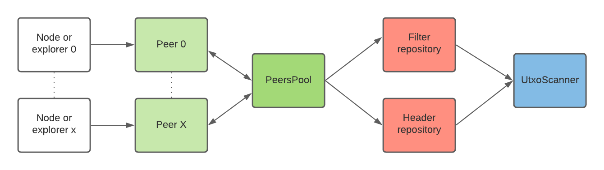

# Neutrino Elements

Neutrino + Elements

## Description

neutrino-elements uses Compact Block Filter (BIP158) to implement a light client for [elements](https://elementsproject.org/)-based networks.

Two services are provided, they can work independantly:
- `PeersPool` maintains a set of peers in order to keep an up-to-date state of the blockchain. It uses the `Peer` interface to fetch two types of data: block headers and compact filters. Then these data are stored using [repositories](https://deviq.com/design-patterns/repository-pattern).
- `UtxoScanner` uses filters and headers repositories to handle `ScanRequest` which aims to know if an outpoint (identified by its script) is spent or not. 

## Getting Started

TODO

## License

MIT - see the LICENSE.md file for details

## Acknowledgments

* [Neutrino - Light bitcoin client](https://github.com/lightninglabs/neutrino)
* [Compact Block Filters for Light Clients - BIP158](https://gist.github.com/PurpleBooth/109311bb0361f32d87a2)